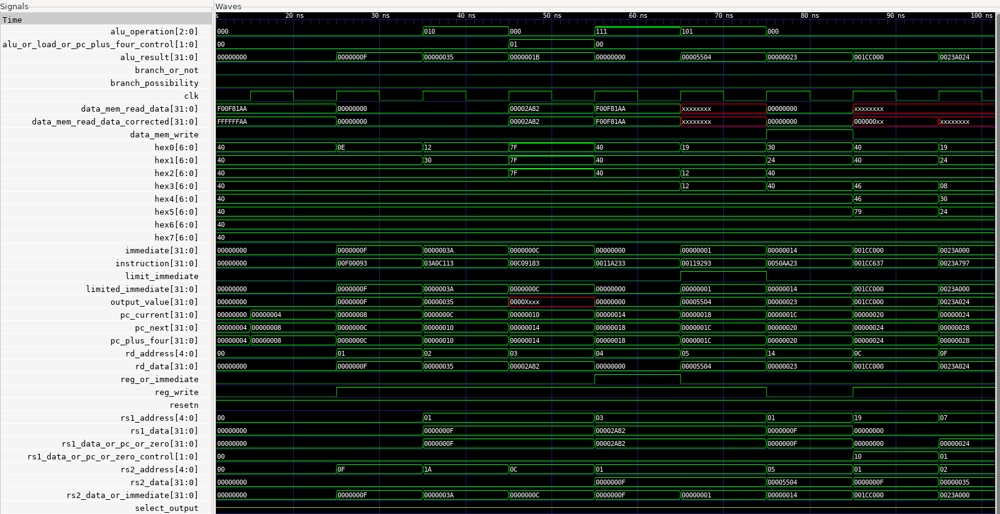

# RISCV-Single-Cycle-Processor
This is an implementation of a single-cycle RISC-V CPU.

### Instructions for use: Simulation

1. Clone the repository using the following command:
```bash
git clone https://github.com/Warren-SJ/RISCV-Single-Cycle-Processor.git
```

2. Create a new project in your preferred FPGA development environment (e.g., Vivado, Quartus, etc.)

3. Add all the `.sv` files to the project

4. Set the top simulation module to `RISCV_Processor_Top_Tb.sv`

5. Run the simulation

To view the simulation waveform, it is recommended that you use gtkwave or any other waveform viewer. To use gtkwave on Windows, you must use the Windows Subsystem for Linux (WSL). Instructions can be found [here](https://learn.microsoft.com/en-us/windows/wsl/install).

Next, run the following command in the Linux terminal:
```bash
sudo apt-get install gtkwave
```

After installing gtkwave, run the following command to open the waveform:
```bash
cd /mnt/path_to_your_project_folder
gtkwave RISC_V_Processor_Top.vcd
```

Note: To change the instructions, change them in `Instruction_Memory.sv`. To obtain instructions, refer to [this](https://luplab.gitlab.io/rvcodecjs/).



### Instructions for use: FPGA Implementation

1. Clone the repository using the following command:
```bash
git clone https://github.com/Warren-SJ/RISCV-Single-Cycle-Processor.git
```

2. Create a new project in your preferred FPGA development environment (e.g., Vivado, Quartus, etc.)

3. Add all the `.sv` files to the project

4. Set the top module to `RISCV_Processor_Top.sv`

5. Run the synthesis and implementation process

6. Map the ports as required. This was implemented on a DE2-115 FPGA board and the port mappings are found in ```Single_Cycle.qsf```. You may import this file into your Quartus project to use the same port mappings.

7. Program the FPGA

Notes:
- The clock is mapped to `KEY0`, and reset is mapped to `KEY3`. The clock is mapped to a button so that the results can be observed on the 7-segment display.
- To reset, press `KEY3` and while pressing it, press `KEY0`.
- The 7-segment display will show the output of the ALU operation or the value being written to register. This may be changed by using `SW17`.

  This design was pipelined and the design is available [here](https://github.com/Warren-SJ/RISCV-Pipelined-Processor).
